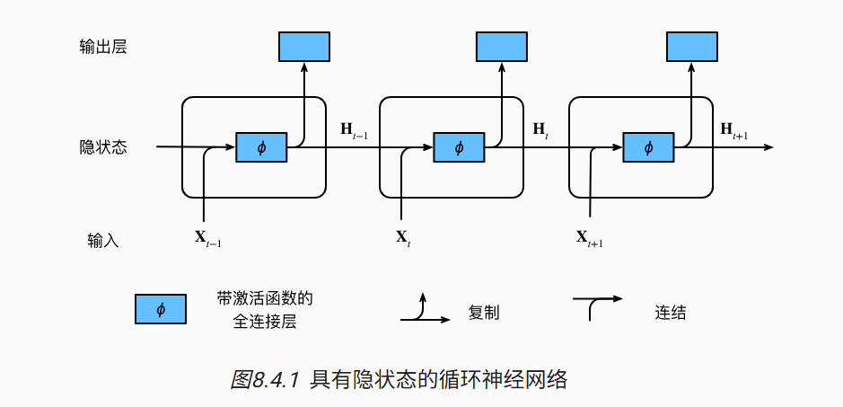

# 一.RNN
## 1.model
- RNN 是自回归模型，通过隐状态来 将序列内容传递下来
- RNN 的当前的隐状态 $H_t$ 由上一层的隐状态 $H_{t-1}$ 与当前的输入$X_{t}$决定
- RNN 当前的输出是由当前的输入 $H_t$ 决定的

- 由公式表达如下：
    - $H_t = Tanh(H_{t-1}W_{hh} + X_{t}W_{hx} + b_{h})$
    - $Q_t = H_tW_{qh} + b_q$
## 2.knowledge
- 1.初始化：
    - **词元向量化：** 统计语料库中所有token的类别（例子 仅仅使用**字符作为token**），即含有26个类别，那么我们使用长度为26的one-hot vector来表示每一个token
    - **隐状态：** 根据hidden_layer、batch_size和num_hiddens来初始化隐状态
- 2.预测：
    - 在使用模型进行预测的时候，创建一个全零的隐状态，然后将提供的文本循环使用模型预测，但不要任何输出，这个过程称为**预热期**
- 3.梯度裁剪：
    - 当我们预测了一个输出后，可以很容易得到损失，对于权重$W_{hq} 和 b_q$很容易计算梯度，但对于$W_{hh}、W_{hq}和b_h$都与 前面的状态相关联，可能会遇到梯度爆炸，所以需要梯度裁剪：设置一个阈值θ，当梯度g的值超过这个阈值，将会放缩到 θ / ||g||
- 4.关于RNN的长度，即$X_{t}$的长度
    - RNN训练时的序列长度由个人决定，为token的个数；这就取决于，假如有一个文本，定义好batch_size和num_steps后，可以根据random或者sequential将文本分成batch_size个batch，且每个batch中的句子都有num_steps个token长度。**注意:根据random或者sequential可以在训练的时候选择一个batch后是否清除隐状态**
- 5.关于RNN模型的一些理解：
    - 如果没有**隐状态**的传输，每一个RNN单元都像是含有一个隐藏层的MLP，输入为one-hot vector，然后根据 输入 和 上一个隐藏层状态 得到当前隐藏层状态，然后生成vocab_size大小的向量，经过softmax计算得分
# 二.GRU
## 1.model
- 相比于RNN的隐状态，GRU提出了R（reset）和Z（update）门，使得当前隐状态需要经过R和Z门
- 公式表达如下：
    - $R_t = sigmoid(X_tW_{rx} + H_{t-1}W_{rh} + b_r)$
    - $Z_t = sigmoid(X_tW_{zx} + H_{t-1}W_{zh} + b_z)$
    - $\widetilde{H_t} = tanh(X_tW_{hx} + (H_{t-1}*R_t)W_{hh} + b_h)$
    - $H_t = H_{t-1}*Z_t + (1 - Z_t)*\widetilde{H_t}$
## 2.knowledge
- 1.因为$R_t和Z_t$都要经过sigmoid函数，所以会被限制在0~1之间，所以 当$R_t$为1，$Z_t$为0时，就是普通的RNN
# 三.LSTM