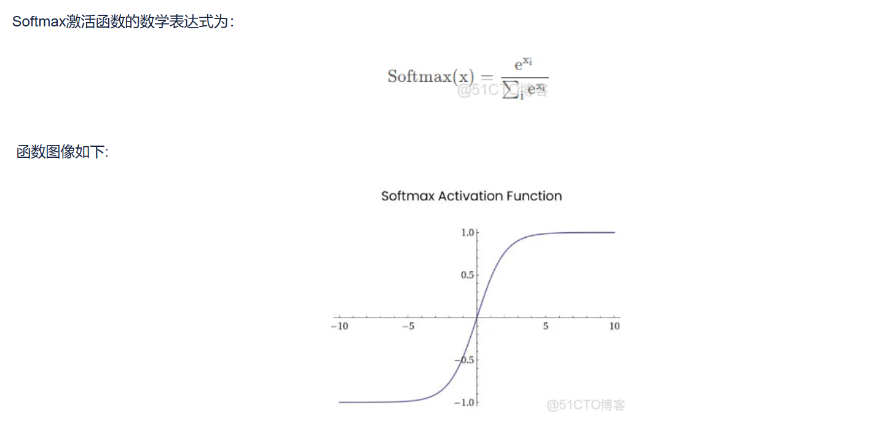
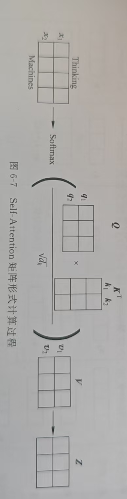

# 一、self-attention(以文本向量为输入向量)
- 1.假如文本为 hello world, 通过向量化 转化为$i_1$, $i_2$，假如长度都为n，shape为n * 1
- 2.如何寻找$i_1$的自注意结果呢？ 首先有三个矩阵$W^Q, W^K, W^V$（初始值随机化， 由模型learn得到）,shape都为m * n，将两个输入向量分别与这三个矩阵相乘( matmul(W, i) )得到 各自文本的查询向量（Queries），键向量（Keys），值向量（Values）分别为$q_1, k_1, v_1, q_2, k_2, v_2$。
- 3.以$i_1$的自注意力机制输出的矩阵为例：
    - 1.首先将$i_1$的查询向量$q_1$分别与各个文本向量的键向量$k_i$点积（dot product）得到相关性分数（很显然，每个向量都是与自己相关性最大）
    - 2.将得到的相关性分数进行除以 $\sqrt{len(q_i)}$，目的是将相关性分数的方差 回归矩阵相乘前，更是为了**避免后一步的softmax计算时出现梯度消失或者梯度爆炸**。前提是查询向量$q_i$ 和 键向量$k_i$的均值都为0， 方差为1。那么每一项相乘后的均值和方差不变，但点积（dot product）最终要将每一项都相加，此时这个数的均值还是0，但是它的方差已经是len($q_i$) * 1, 假设经过点积后，我们得到了两个数：[100, 10]。放进 Softmax 里，因为 $e^{100}$ 比 $e^{10}$ 大得太多太多了，Softmax 的输出会变成极其极端的：[0.999999..., 0.0000...]。原本我们希望 Attention 是一个“软注意力”（大家都有一定的权重，比如 [0.7, 0.3]），结果现在变成了“赢者通吃”的 One-hot 向量。这种现象叫做 Softmax 饱和。Softmax图像如下： 即当这个值非常大的时候，函数在这个位置是一条直线，导数就是几乎为0，即传给前面Q和K导数就0，梯度消失了，所以我们要除以$\sqrt{len(q_i)}$,因为查询向量$q_i$和键向量$k_i$ 点积后的结果的方差就是${len(q_i)}$
    - 3.就是需要对相关性分数进行Softmax函数激活
    - 4.将每个值向量$v_i$乘以对应的Softmax分数，目的是对每个单词的重要程序重新分配。最后是加权值向量（就是上面每个值向量$v_i$乘以对应的Softmax分数的操作）求和的操作
- 4.在实际中，会将输入向量打包成矩阵，以矩阵完成此计算：$Attention（Q, K, V） = Softmax(\frac{QK^T}{\sqrt{d_k}})V$,其中Q，K，V是输入矩阵，分别是查询矩阵，键矩阵，值矩阵，$d_k$是向量维度
# 二、Mutil-head Attention
- 一组$W^Q, W^K, W^V$相当于寻找一个句子相关性，但从不同的角度来看，可能会有不同的句子相关性，所以提出了mutil-head Attention，就是使用多组$W^Q, W^K, W^V$，与单头不同的是，多组（多个头）计算出的结果向量，最后需要拼接在一起，并经过一个额外的**输出权重矩阵（$W^O$）**进行融合，转化为最终的输出矩阵。
# 三、Encoder
- Encoder由6层堆叠而成，每一层包含两部分，分别是**mutil-head attention**和**feed forward neural**，两个部分后都有add&norm（残差连接层和normalization层，现在多是norm&add）。其中mha 主要负责全局特征的筛选与聚合（依赖 Softmax 的非线性实现权重分配），是偏线性的， 而 ffn 负责对每个位置进行深度的非线性特征变换，ffn由一个全连接层+relu（gelu）激活函数+全连接层，正是激活函数起到非线性表达能力

# Q&A
- Q1：Q、K、V 只是人类为了方便理解而赋予的主观概念，在代码里它们只是三个通过同一个输入 $X$ 乘出来的矩阵，既然都是反向传播更新，它们为什么不会学成完全相同的权重？（这是一个暂时缺乏足够数学理论的学科哈哈哈）
- A1:
    - 1.在公式中，Q 和 K 进入了 Softmax 内部参与内积，决定注意力分布，而 V 在外部被线性加权。这种结构上的不平等，导致反向传播时，传导给 $W_Q, W_K$ 和 $W_V$ 的梯度流是完全不同的。
    - 2.如果 $W_Q$ 和 $W_K$ 同质化，模型就会退化为只关注自身的恒等映射，无法捕获全局上下文，导致 Loss 很大。
    - 3.是最终的 Loss 函数，通过数以万计的迭代，逼迫这三个矩阵打破对称性，最终演化出了类似‘查询、索引、内容提取’的功能。我们人类的解释，只是对它们收敛后状态的一种生动总结。”
- Q2: 在自注意力机制中，为什么要添加position information呢？
- A2：
    - 因为如果没有position information，就导致 “我喜欢吃苹果” 和 “苹果喜欢吃我”输出的自注意力机制的输出矩阵的结果相同
    - 通过固定位置编码 或者 可learn的位置编码 都可以产生每个位置的位置向量，token向量 + 位置向量就可以 让不同位置的token向量不同。比如“我喜欢吃苹果”和“苹果喜欢吃我”中的“苹果”的token向量是相同的，但他们一个是['我', '喜欢', '吃', '苹果']， 另外一个是['苹果', '喜欢', '吃', '我']，“苹果”的位置不同，则它的位置向量就不同，那么这两个句子的训练结果就会不同，值得一提的是不管是固定位置编码还是可以learn的位置编码，同一位置的token的位置向量是一致的